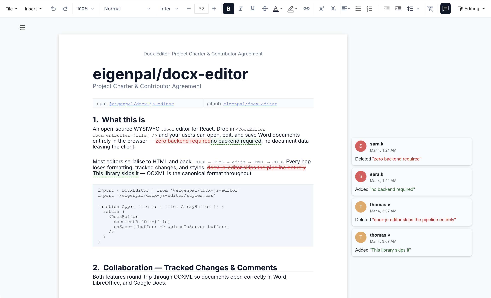

<p align="center">
  <a href="https://github.com/eigenpal/docx-js-editor">
    
  </a>
</p>

<p align="center">
  <a href="https://www.npmjs.com/package/@eigenpal/docx-js-editor"></a>
  <a href="https://www.npmjs.com/package/@eigenpal/docx-js-editor"></a>
  <a href="https://github.com/eigenpal/docx-js-editor/blob/main/LICENSE"></a>
  <a href="https://docx-js-editor.vercel.app/"></a>
</p>

# @eigenpal/docx-js-editor

Open-source WYSIWYG DOCX editor for the browser. No server required. **[Live demo](https://docx-js-editor.vercel.app/)**

For AI agents: see the [Agent Reference](https://raw.githubusercontent.com/eigenpal/docx-editor/main/AGENTS_README.md) for comprehensive API docs, code examples, and integration patterns.

<p align="center">
  <a href="https://docx-js-editor.vercel.app/">
    
  </a>
</p>

- WYSIWYG editing with Word fidelity — formatting, tables, images, hyperlinks
- Track changes (suggestion mode) with accept/reject
- Comments with replies, resolve/reopen, scroll-to-highlight
- Plugin system, undo/redo, find & replace, print preview
- Client-side only, zero server dependencies

## Quick Start

```bash
npm install @eigenpal/docx-js-editor
```

```tsx
import { useRef } from 'react';
import { DocxEditor, type DocxEditorRef } from '@eigenpal/docx-js-editor';
import '@eigenpal/docx-js-editor/styles.css';

function Editor({ file }: { file: ArrayBuffer }) {
  const editorRef = useRef<DocxEditorRef>(null);
  return <DocxEditor ref={editorRef} documentBuffer={file} mode="editing" onChange={() => {}} />;
}
```

> **Next.js / SSR:** Use dynamic import — the editor requires the DOM.

## Packages

| Package                                      | Description                                                  |
| -------------------------------------------- | ------------------------------------------------------------ |
| [`@eigenpal/docx-js-editor`](packages/react) | React UI — toolbar, paged editor, plugins. **Install this.** |
| [`@eigenpal/docx-editor-vue`](packages/vue)  | Vue.js scaffold — contributions welcome                      |

## Plugins

```tsx
import { DocxEditor, PluginHost, templatePlugin } from '@eigenpal/docx-js-editor';

<PluginHost plugins={[templatePlugin]}>
  <DocxEditor documentBuffer={file} />
</PluginHost>;
```

See [docs/PLUGINS.md](docs/PLUGINS.md) for the full plugin API.

## Development

```bash
bun install
bun run dev        # localhost:5173
bun run build
bun run typecheck
```

Examples: [Vite](examples/vite) | [Next.js](examples/nextjs) | [Remix](examples/remix) | [Astro](examples/astro) | [Vue](examples/vue)

**[Props & Ref Methods](docs/PROPS.md)** | **[Plugins](docs/PLUGINS.md)** | **[Architecture](docs/ARCHITECTURE.md)**

## License

MIT
